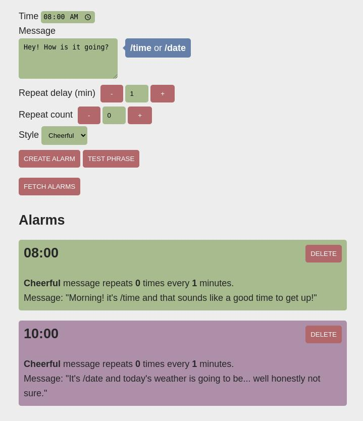

# Home Speak

[](https://codecov.io/gh/dmweis/home_speak)
[](https://github.com/dmweis/home_speak/actions)
[](https://davidweis.dev/home_speak/home_speak/index.html)

Play messages submitted over MQTT or REST api into voice using google text to speech

## API token

### Google TTS

You should be able to create API token for your google account [here](https://console.developers.google.com/apis/credentials)

### Azure TTS

Generate tokens using your [Azure portal](https://portal.azure.com)

## Usage

### Simple curl call

```bash
curl localhost:3000/say --data "Test string"
```

### Web interface



## Configuration

Server expects configuration file

```yaml
tts_service_config:
  cache_dir_path: PATH_TO_CACHE_DIR
  tts_service: "Azure" # This isn't respected by all calls anymore
  google_api_key: "GOOGLE_API_KEY"
  azure_api_key: "AZURE_API_KEY"
server_config:
  host: "0.0.0.0"
  port: 3000
assistant_config:
  name: "Joy"
  primary_user_name: "User"
alarm_config:
  save_file_path: PATH_TO_ALARM_SAVE_FILE
```

### building

build with `cargo build --features hotreload` to get html page hot-reloading otherwise the `html` file is embedded in the binary at compilation.  

## Install

Use `install_service` to install as a systemd service.  
It might be a good idea to transition to something like `cargo-deb` in the future.  

### Cargo deb

Now with partial support!

## Dependencies

In case build fails with alsa-sys build stepa you want to install dev dependencies for `alsa`.  
On debian the package is called `libasound2-dev`.  
You may also need `libssl-dev` depending on which ssl library you are using.  

```bash
sudo apt install libssl-dev libasound2-dev -y
```


## Audio on raspberry pi

depending on if you are running as user or system you'll want to have the following config

```shell
pcm.!default {
    type hw
    card 1
}
ctl.!default {
    type hw
    card 1
}
```

either in `~/.asoundrc` or `/etc/asound.conf`
